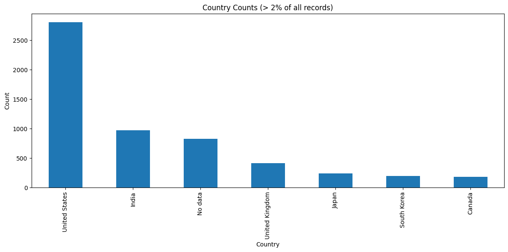
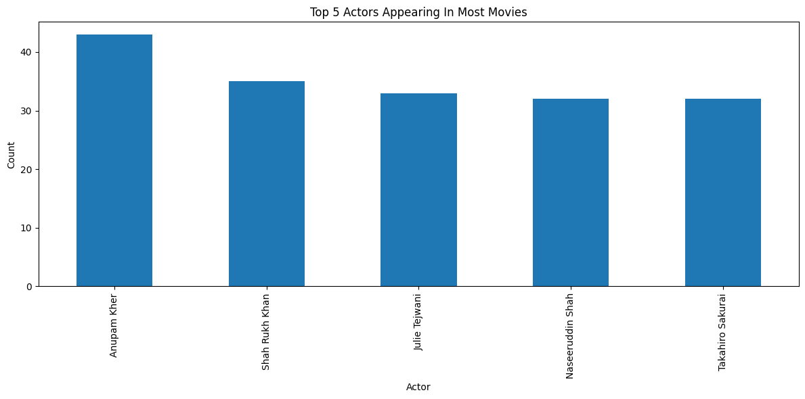
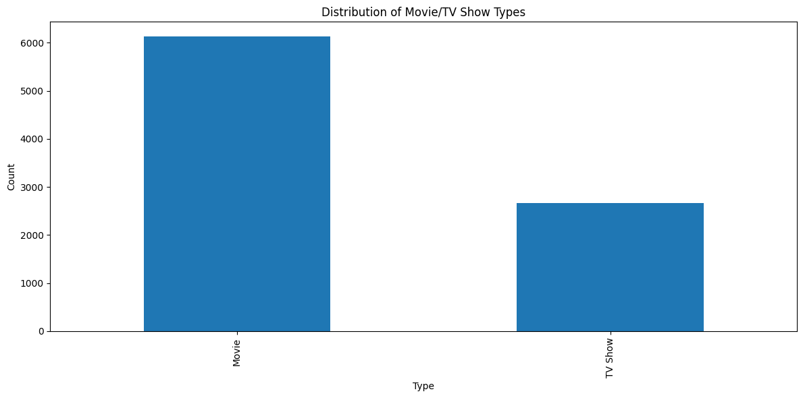
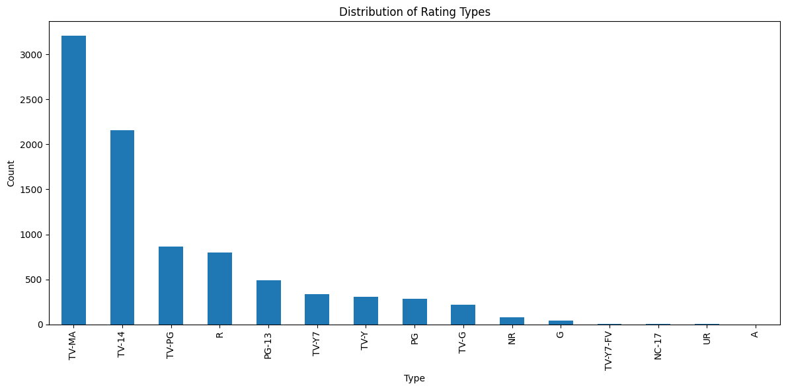

## Netflix Movies and TV Shows

### Dataset: 
https://www.kaggle.com/datasets/rahulvyasm/netflix-movies-and-tv-shows

### Data description:
- show_id: A unique identifier for each title.
- type: The category of the title, which is either 'Movie' or 'TV Show'.
- title: The name of the movie or TV show.
- director: The director(s) of the movie or TV show. (Contains null values for some entries, especially TV shows where this information might not be applicable.) cast: The list of main actors/actresses in the title. (Some entries might not have this information.)
- country: The country or countries where the movie or TV show was produced.
- date_added: The date the title was added to Netflix.
- release_year: The year the movie or TV show was originally released.
- rating: The age rating of the title.
- duration: The duration of the title, in minutes for movies and seasons for TV shows.
- listed_in: The genres the title falls under.
- description: A brief summary of the title.

### Importing libraries


```python
import pandas as pd
import matplotlib.pyplot as plt
import seaborn as sns
from datetime import datetime
import re

## recommendation system
from sklearn.feature_extraction.text import TfidfVectorizer
from sklearn.metrics.pairwise import cosine_similarity
```

### Loading data


```python
netflix_movies = pd.read_csv('data/netflix_titles.csv', delimiter=',', decimal='.', index_col=0, encoding='latin1',  dtype={'listed_in': 'object', 'country': 'object'})
```

### Data exploration


```python
netflix_movies.info()
```

    <class 'pandas.core.frame.DataFrame'>
    Index: 8809 entries, s1 to s8809
    Data columns (total 25 columns):
     #   Column        Non-Null Count  Dtype  
    ---  ------        --------------  -----  
     0   type          8809 non-null   object 
     1   title         8809 non-null   object 
     2   director      6175 non-null   object 
     3   cast          7984 non-null   object 
     4   country       7978 non-null   object 
     5   date_added    8799 non-null   object 
     6   release_year  8809 non-null   int64  
     7   rating        8805 non-null   object 
     8   duration      8806 non-null   object 
     9   listed_in     8809 non-null   object 
     10  description   8809 non-null   object 
     11  Unnamed: 12   0 non-null      float64
     12  Unnamed: 13   0 non-null      float64
     13  Unnamed: 14   0 non-null      float64
     14  Unnamed: 15   0 non-null      float64
     15  Unnamed: 16   0 non-null      float64
     16  Unnamed: 17   0 non-null      float64
     17  Unnamed: 18   0 non-null      float64
     18  Unnamed: 19   0 non-null      float64
     19  Unnamed: 20   0 non-null      float64
     20  Unnamed: 21   0 non-null      float64
     21  Unnamed: 22   0 non-null      float64
     22  Unnamed: 23   0 non-null      float64
     23  Unnamed: 24   0 non-null      float64
     24  Unnamed: 25   0 non-null      float64
    dtypes: float64(14), int64(1), object(10)
    memory usage: 2.0+ MB
    


```python
netflix_movies.describe()
```


<div>
<style scoped>
    .dataframe tbody tr th:only-of-type {
        vertical-align: middle;
    }

    .dataframe tbody tr th {
        vertical-align: top;
    }

    .dataframe thead th {
        text-align: right;
    }
</style>
<table border="1" class="dataframe">
  <thead>
    <tr style="text-align: right;">
      <th></th>
      <th>release_year</th>
      <th>Unnamed: 12</th>
      <th>Unnamed: 13</th>
      <th>Unnamed: 14</th>
      <th>Unnamed: 15</th>
      <th>Unnamed: 16</th>
      <th>Unnamed: 17</th>
      <th>Unnamed: 18</th>
      <th>Unnamed: 19</th>
      <th>Unnamed: 20</th>
      <th>Unnamed: 21</th>
      <th>Unnamed: 22</th>
      <th>Unnamed: 23</th>
      <th>Unnamed: 24</th>
      <th>Unnamed: 25</th>
    </tr>
  </thead>
  <tbody>
    <tr>
      <th>count</th>
      <td>8809.000000</td>
      <td>0.0</td>
      <td>0.0</td>
      <td>0.0</td>
      <td>0.0</td>
      <td>0.0</td>
      <td>0.0</td>
      <td>0.0</td>
      <td>0.0</td>
      <td>0.0</td>
      <td>0.0</td>
      <td>0.0</td>
      <td>0.0</td>
      <td>0.0</td>
      <td>0.0</td>
    </tr>
    <tr>
      <th>mean</th>
      <td>2014.181292</td>
      <td>NaN</td>
      <td>NaN</td>
      <td>NaN</td>
      <td>NaN</td>
      <td>NaN</td>
      <td>NaN</td>
      <td>NaN</td>
      <td>NaN</td>
      <td>NaN</td>
      <td>NaN</td>
      <td>NaN</td>
      <td>NaN</td>
      <td>NaN</td>
      <td>NaN</td>
    </tr>
    <tr>
      <th>std</th>
      <td>8.818932</td>
      <td>NaN</td>
      <td>NaN</td>
      <td>NaN</td>
      <td>NaN</td>
      <td>NaN</td>
      <td>NaN</td>
      <td>NaN</td>
      <td>NaN</td>
      <td>NaN</td>
      <td>NaN</td>
      <td>NaN</td>
      <td>NaN</td>
      <td>NaN</td>
      <td>NaN</td>
    </tr>
    <tr>
      <th>min</th>
      <td>1925.000000</td>
      <td>NaN</td>
      <td>NaN</td>
      <td>NaN</td>
      <td>NaN</td>
      <td>NaN</td>
      <td>NaN</td>
      <td>NaN</td>
      <td>NaN</td>
      <td>NaN</td>
      <td>NaN</td>
      <td>NaN</td>
      <td>NaN</td>
      <td>NaN</td>
      <td>NaN</td>
    </tr>
    <tr>
      <th>25%</th>
      <td>2013.000000</td>
      <td>NaN</td>
      <td>NaN</td>
      <td>NaN</td>
      <td>NaN</td>
      <td>NaN</td>
      <td>NaN</td>
      <td>NaN</td>
      <td>NaN</td>
      <td>NaN</td>
      <td>NaN</td>
      <td>NaN</td>
      <td>NaN</td>
      <td>NaN</td>
      <td>NaN</td>
    </tr>
    <tr>
      <th>50%</th>
      <td>2017.000000</td>
      <td>NaN</td>
      <td>NaN</td>
      <td>NaN</td>
      <td>NaN</td>
      <td>NaN</td>
      <td>NaN</td>
      <td>NaN</td>
      <td>NaN</td>
      <td>NaN</td>
      <td>NaN</td>
      <td>NaN</td>
      <td>NaN</td>
      <td>NaN</td>
      <td>NaN</td>
    </tr>
    <tr>
      <th>75%</th>
      <td>2019.000000</td>
      <td>NaN</td>
      <td>NaN</td>
      <td>NaN</td>
      <td>NaN</td>
      <td>NaN</td>
      <td>NaN</td>
      <td>NaN</td>
      <td>NaN</td>
      <td>NaN</td>
      <td>NaN</td>
      <td>NaN</td>
      <td>NaN</td>
      <td>NaN</td>
      <td>NaN</td>
    </tr>
    <tr>
      <th>max</th>
      <td>2024.000000</td>
      <td>NaN</td>
      <td>NaN</td>
      <td>NaN</td>
      <td>NaN</td>
      <td>NaN</td>
      <td>NaN</td>
      <td>NaN</td>
      <td>NaN</td>
      <td>NaN</td>
      <td>NaN</td>
      <td>NaN</td>
      <td>NaN</td>
      <td>NaN</td>
      <td>NaN</td>
    </tr>
  </tbody>
</table>
</div>


```python
null_counts = netflix_movies.isnull().sum()
print("Number of null values in each column:\n{}".format(null_counts))
```

    Number of null values in each column:
    type               0
    title              0
    director        2634
    cast             825
    country          831
    date_added        10
    release_year       0
    rating             4
    duration           3
    listed_in          0
    description        0
    Unnamed: 12     8809
    Unnamed: 13     8809
    Unnamed: 14     8809
    Unnamed: 15     8809
    Unnamed: 16     8809
    Unnamed: 17     8809
    Unnamed: 18     8809
    Unnamed: 19     8809
    Unnamed: 20     8809
    Unnamed: 21     8809
    Unnamed: 22     8809
    Unnamed: 23     8809
    Unnamed: 24     8809
    Unnamed: 25     8809
    dtype: int64
    


```python
num_rows = len(netflix_movies)
num_rows
```


    8809


### Data cleaning

#### Deleting unnamed columns


```python
# drop unnamed columns
netflix_movies.drop(netflix_movies.columns[netflix_movies.columns.str.contains('unnamed', case=False)], axis=1, inplace=True)
```


```python
# null counts
null_counts = netflix_movies.isnull().sum()
print("Number of null values in each column:\n{}".format(null_counts))
```

    Number of null values in each column:
    type               0
    title              0
    director        2634
    cast             825
    country          831
    date_added        10
    release_year       0
    rating             4
    duration           3
    listed_in          0
    description        0
    dtype: int64
    

#### Handling missing data


```python
netflix_movies["director"] = netflix_movies["director"].fillna('No data') 
netflix_movies["country"] = netflix_movies["country"].fillna('No data') 
netflix_movies["cast"] = netflix_movies["cast"].fillna('No data') 
netflix_movies.dropna(subset=['date_added','rating','duration'],inplace=True) 

null_counts = netflix_movies.isnull().sum()
print("Number of null values in each column:\n{}".format(null_counts))
```

    Number of null values in each column:
    type            0
    title           0
    director        0
    cast            0
    country         0
    date_added      0
    release_year    0
    rating          0
    duration        0
    listed_in       0
    description     0
    dtype: int64
    

#### Converting data types for easier access

##### Split 'cast' and 'listed_in' to list


```python
netflix_movies["cast"] = netflix_movies["cast"].str.split(",")
netflix_movies["cast"] = netflix_movies["cast"].apply(lambda x: [item.strip() for item in x if item.strip() != ''])
```


```python
netflix_movies["listed_in"] = netflix_movies["listed_in"].str.split(",")
netflix_movies["listed_in"] = netflix_movies["listed_in"].apply(lambda x: [item.strip() for item in x])
```


```python
netflix_movies.head()
```


<div>
<style scoped>
    .dataframe tbody tr th:only-of-type {
        vertical-align: middle;
    }

    .dataframe tbody tr th {
        vertical-align: top;
    }

    .dataframe thead th {
        text-align: right;
    }
</style>
<table border="1" class="dataframe">
  <thead>
    <tr style="text-align: right;">
      <th></th>
      <th>type</th>
      <th>title</th>
      <th>director</th>
      <th>cast</th>
      <th>country</th>
      <th>date_added</th>
      <th>release_year</th>
      <th>rating</th>
      <th>duration</th>
      <th>listed_in</th>
      <th>description</th>
    </tr>
    <tr>
      <th>show_id</th>
      <th></th>
      <th></th>
      <th></th>
      <th></th>
      <th></th>
      <th></th>
      <th></th>
      <th></th>
      <th></th>
      <th></th>
      <th></th>
    </tr>
  </thead>
  <tbody>
    <tr>
      <th>s1</th>
      <td>Movie</td>
      <td>Dick Johnson Is Dead</td>
      <td>Kirsten Johnson</td>
      <td>[No data]</td>
      <td>United States</td>
      <td>September 25, 2021</td>
      <td>2020</td>
      <td>PG-13</td>
      <td>90 min</td>
      <td>[Documentaries]</td>
      <td>As her father nears the end of his life, filmm...</td>
    </tr>
    <tr>
      <th>s2</th>
      <td>TV Show</td>
      <td>Blood &amp; Water</td>
      <td>No data</td>
      <td>[Ama Qamata, Khosi Ngema, Gail Mabalane, Thaba...</td>
      <td>South Africa</td>
      <td>September 24, 2021</td>
      <td>2021</td>
      <td>TV-MA</td>
      <td>2 Seasons</td>
      <td>[International TV Shows, TV Dramas, TV Mysteries]</td>
      <td>After crossing paths at a party, a Cape Town t...</td>
    </tr>
    <tr>
      <th>s3</th>
      <td>TV Show</td>
      <td>Ganglands</td>
      <td>Julien Leclercq</td>
      <td>[Sami Bouajila, Tracy Gotoas, Samuel Jouy, Nab...</td>
      <td>No data</td>
      <td>September 24, 2021</td>
      <td>2021</td>
      <td>TV-MA</td>
      <td>1 Season</td>
      <td>[Crime TV Shows, International TV Shows, TV Ac...</td>
      <td>To protect his family from a powerful drug lor...</td>
    </tr>
    <tr>
      <th>s4</th>
      <td>TV Show</td>
      <td>Jailbirds New Orleans</td>
      <td>No data</td>
      <td>[No data]</td>
      <td>No data</td>
      <td>September 24, 2021</td>
      <td>2021</td>
      <td>TV-MA</td>
      <td>1 Season</td>
      <td>[Docuseries, Reality TV]</td>
      <td>Feuds, flirtations and toilet talk go down amo...</td>
    </tr>
    <tr>
      <th>s5</th>
      <td>TV Show</td>
      <td>Kota Factory</td>
      <td>No data</td>
      <td>[Mayur More, Jitendra Kumar, Ranjan Raj, Alam ...</td>
      <td>India</td>
      <td>September 24, 2021</td>
      <td>2021</td>
      <td>TV-MA</td>
      <td>2 Seasons</td>
      <td>[International TV Shows, Romantic TV Shows, TV...</td>
      <td>In a city of coaching centers known to train I...</td>
    </tr>
  </tbody>
</table>
</div>


##### Convert 'date_added' to datetime 


```python
netflix_movies['date_added'] = netflix_movies['date_added'].str.strip()
netflix_movies['date_added'] = pd.to_datetime(netflix_movies['date_added'], errors='coerce')
print(netflix_movies['date_added'])
```

    show_id
    s1      2021-09-25
    s2      2021-09-24
    s3      2021-09-24
    s4      2021-09-24
    s5      2021-09-24
               ...    
    s8805   2019-11-01
    s8806   2020-01-11
    s8807   2019-03-02
    s8808   2024-04-05
    s8809   2024-04-05
    Name: date_added, Length: 8792, dtype: datetime64[ns]
    

##### Seperating duration of films and TV series
- movies: minutes
- tv show: seasons


```python
duration_minutes_column = []
duration_seasons_column = []

for time in netflix_movies['duration']:
    if time.find('Season') == -1:
        new_time = re.sub('[ min]', '', time)
        duration_minutes_column.append(int(new_time))
        duration_seasons_column.append(None)
    else:
        new_time = re.sub('[ Season]', '', time)
        duration_minutes_column.append(None)
        duration_seasons_column.append(int(new_time))

netflix_movies.rename(columns={'duration':'duration_seasons'}, inplace=True)
netflix_movies['duration_seasons'] = duration_seasons_column
netflix_movies['duration_minutes'] = duration_minutes_column
netflix_movies.head()
```


<div>
<style scoped>
    .dataframe tbody tr th:only-of-type {
        vertical-align: middle;
    }

    .dataframe tbody tr th {
        vertical-align: top;
    }

    .dataframe thead th {
        text-align: right;
    }
</style>
<table border="1" class="dataframe">
  <thead>
    <tr style="text-align: right;">
      <th></th>
      <th>type</th>
      <th>title</th>
      <th>director</th>
      <th>cast</th>
      <th>country</th>
      <th>date_added</th>
      <th>release_year</th>
      <th>rating</th>
      <th>duration_seasons</th>
      <th>listed_in</th>
      <th>description</th>
      <th>duration_minutes</th>
    </tr>
    <tr>
      <th>show_id</th>
      <th></th>
      <th></th>
      <th></th>
      <th></th>
      <th></th>
      <th></th>
      <th></th>
      <th></th>
      <th></th>
      <th></th>
      <th></th>
      <th></th>
    </tr>
  </thead>
  <tbody>
    <tr>
      <th>s1</th>
      <td>Movie</td>
      <td>Dick Johnson Is Dead</td>
      <td>Kirsten Johnson</td>
      <td>[No data]</td>
      <td>United States</td>
      <td>2021-09-25</td>
      <td>2020</td>
      <td>PG-13</td>
      <td>NaN</td>
      <td>[Documentaries]</td>
      <td>As her father nears the end of his life, filmm...</td>
      <td>90.0</td>
    </tr>
    <tr>
      <th>s2</th>
      <td>TV Show</td>
      <td>Blood &amp; Water</td>
      <td>No data</td>
      <td>[Ama Qamata, Khosi Ngema, Gail Mabalane, Thaba...</td>
      <td>South Africa</td>
      <td>2021-09-24</td>
      <td>2021</td>
      <td>TV-MA</td>
      <td>2.0</td>
      <td>[International TV Shows, TV Dramas, TV Mysteries]</td>
      <td>After crossing paths at a party, a Cape Town t...</td>
      <td>NaN</td>
    </tr>
    <tr>
      <th>s3</th>
      <td>TV Show</td>
      <td>Ganglands</td>
      <td>Julien Leclercq</td>
      <td>[Sami Bouajila, Tracy Gotoas, Samuel Jouy, Nab...</td>
      <td>No data</td>
      <td>2021-09-24</td>
      <td>2021</td>
      <td>TV-MA</td>
      <td>1.0</td>
      <td>[Crime TV Shows, International TV Shows, TV Ac...</td>
      <td>To protect his family from a powerful drug lor...</td>
      <td>NaN</td>
    </tr>
    <tr>
      <th>s4</th>
      <td>TV Show</td>
      <td>Jailbirds New Orleans</td>
      <td>No data</td>
      <td>[No data]</td>
      <td>No data</td>
      <td>2021-09-24</td>
      <td>2021</td>
      <td>TV-MA</td>
      <td>1.0</td>
      <td>[Docuseries, Reality TV]</td>
      <td>Feuds, flirtations and toilet talk go down amo...</td>
      <td>NaN</td>
    </tr>
    <tr>
      <th>s5</th>
      <td>TV Show</td>
      <td>Kota Factory</td>
      <td>No data</td>
      <td>[Mayur More, Jitendra Kumar, Ranjan Raj, Alam ...</td>
      <td>India</td>
      <td>2021-09-24</td>
      <td>2021</td>
      <td>TV-MA</td>
      <td>2.0</td>
      <td>[International TV Shows, Romantic TV Shows, TV...</td>
      <td>In a city of coaching centers known to train I...</td>
      <td>NaN</td>
    </tr>
  </tbody>
</table>
</div>


### Dataset after cleaning


```python
netflix_movies.head()
```


<div>
<style scoped>
    .dataframe tbody tr th:only-of-type {
        vertical-align: middle;
    }

    .dataframe tbody tr th {
        vertical-align: top;
    }

    .dataframe thead th {
        text-align: right;
    }
</style>
<table border="1" class="dataframe">
  <thead>
    <tr style="text-align: right;">
      <th></th>
      <th>type</th>
      <th>title</th>
      <th>director</th>
      <th>cast</th>
      <th>country</th>
      <th>date_added</th>
      <th>release_year</th>
      <th>rating</th>
      <th>duration_seasons</th>
      <th>listed_in</th>
      <th>description</th>
      <th>duration_minutes</th>
    </tr>
    <tr>
      <th>show_id</th>
      <th></th>
      <th></th>
      <th></th>
      <th></th>
      <th></th>
      <th></th>
      <th></th>
      <th></th>
      <th></th>
      <th></th>
      <th></th>
      <th></th>
    </tr>
  </thead>
  <tbody>
    <tr>
      <th>s1</th>
      <td>Movie</td>
      <td>Dick Johnson Is Dead</td>
      <td>Kirsten Johnson</td>
      <td>[No data]</td>
      <td>United States</td>
      <td>2021-09-25</td>
      <td>2020</td>
      <td>PG-13</td>
      <td>NaN</td>
      <td>[Documentaries]</td>
      <td>As her father nears the end of his life, filmm...</td>
      <td>90.0</td>
    </tr>
    <tr>
      <th>s2</th>
      <td>TV Show</td>
      <td>Blood &amp; Water</td>
      <td>No data</td>
      <td>[Ama Qamata, Khosi Ngema, Gail Mabalane, Thaba...</td>
      <td>South Africa</td>
      <td>2021-09-24</td>
      <td>2021</td>
      <td>TV-MA</td>
      <td>2.0</td>
      <td>[International TV Shows, TV Dramas, TV Mysteries]</td>
      <td>After crossing paths at a party, a Cape Town t...</td>
      <td>NaN</td>
    </tr>
    <tr>
      <th>s3</th>
      <td>TV Show</td>
      <td>Ganglands</td>
      <td>Julien Leclercq</td>
      <td>[Sami Bouajila, Tracy Gotoas, Samuel Jouy, Nab...</td>
      <td>No data</td>
      <td>2021-09-24</td>
      <td>2021</td>
      <td>TV-MA</td>
      <td>1.0</td>
      <td>[Crime TV Shows, International TV Shows, TV Ac...</td>
      <td>To protect his family from a powerful drug lor...</td>
      <td>NaN</td>
    </tr>
    <tr>
      <th>s4</th>
      <td>TV Show</td>
      <td>Jailbirds New Orleans</td>
      <td>No data</td>
      <td>[No data]</td>
      <td>No data</td>
      <td>2021-09-24</td>
      <td>2021</td>
      <td>TV-MA</td>
      <td>1.0</td>
      <td>[Docuseries, Reality TV]</td>
      <td>Feuds, flirtations and toilet talk go down amo...</td>
      <td>NaN</td>
    </tr>
    <tr>
      <th>s5</th>
      <td>TV Show</td>
      <td>Kota Factory</td>
      <td>No data</td>
      <td>[Mayur More, Jitendra Kumar, Ranjan Raj, Alam ...</td>
      <td>India</td>
      <td>2021-09-24</td>
      <td>2021</td>
      <td>TV-MA</td>
      <td>2.0</td>
      <td>[International TV Shows, Romantic TV Shows, TV...</td>
      <td>In a city of coaching centers known to train I...</td>
      <td>NaN</td>
    </tr>
  </tbody>
</table>
</div>


```python
netflix_movies.info()
```

    <class 'pandas.core.frame.DataFrame'>
    Index: 8792 entries, s1 to s8809
    Data columns (total 12 columns):
     #   Column            Non-Null Count  Dtype         
    ---  ------            --------------  -----         
     0   type              8792 non-null   object        
     1   title             8792 non-null   object        
     2   director          8792 non-null   object        
     3   cast              8792 non-null   object        
     4   country           8792 non-null   object        
     5   date_added        8792 non-null   datetime64[ns]
     6   release_year      8792 non-null   int64         
     7   rating            8792 non-null   object        
     8   duration_seasons  2665 non-null   float64       
     9   listed_in         8792 non-null   object        
     10  description       8792 non-null   object        
     11  duration_minutes  6127 non-null   float64       
    dtypes: datetime64[ns](1), float64(2), int64(1), object(8)
    memory usage: 892.9+ KB
    


```python
null_counts = netflix_movies.isnull().sum()
print("Number of null values in each column:\n{}".format(null_counts))
```

    Number of null values in each column:
    type                   0
    title                  0
    director               0
    cast                   0
    country                0
    date_added             0
    release_year           0
    rating                 0
    duration_seasons    6127
    listed_in              0
    description            0
    duration_minutes    2665
    dtype: int64
    

### Feature engineering

#### Adding columns for more data

##### How old is the Movie


```python
current_year = datetime.now().year
netflix_movies['how_old'] = (int(current_year)-netflix_movies['release_year'])

netflix_movies['how_old']
```


    show_id
    s1        4
    s2        3
    s3        3
    s4        3
    s5        3
             ..
    s8805    15
    s8806    18
    s8807     9
    s8808     0
    s8809    10
    Name: how_old, Length: 8792, dtype: int64


##### Difference betweeen year released and year added


```python
netflix_movies['added_delay'] = (pd.to_datetime(netflix_movies['date_added'], errors='coerce').dt.year-netflix_movies['release_year'])

netflix_movies['added_delay']
```


    show_id
    s1        1
    s2        0
    s3        0
    s4        0
    s5        0
             ..
    s8805    10
    s8806    14
    s8807     4
    s8808     0
    s8809    10
    Name: added_delay, Length: 8792, dtype: int64


### Analysis charts


```python
# Count the number of occurrences for each country
country_counts = netflix_movies['country'].explode().value_counts()

# Calculate the total number of records
total_records = netflix_movies.shape[0]

# Filter the countries with more than 2% of all records
top_countries = country_counts[country_counts / total_records > 0.02].index

# Create a bar chart for the top countries
plt.figure(figsize=(12, 6))
country_counts[top_countries].plot(kind='bar')
plt.title('Country Counts (> 2% of all records)')
plt.xlabel('Country')
plt.ylabel('Count')
plt.xticks(rotation=90)
plt.tight_layout()
plt.show()
```


    

    


```python
# Count the number of occurrences for each genre
genre_counts = netflix_movies['listed_in'].explode().value_counts()

# Calculate the total number of records
total_records = netflix_movies.shape[0]

# Filter the genres with more than 2% of all records
top_genres = genre_counts[genre_counts / total_records > 0.02].index

# Create a bar chart for the top genres
plt.figure(figsize=(12, 6))
genre_counts[top_genres].plot(kind='bar')
plt.title('Genre Counts (> 2% of all records)')
plt.xlabel('Genre')
plt.ylabel('Count')
plt.xticks(rotation=90)
plt.tight_layout()
plt.show()
```


    

    


```python
# Count the number of occurrences for each genre
actor_counts = netflix_movies['cast'].explode().value_counts()
actor_counts = actor_counts[actor_counts.index != 'No data']

top_actors = actor_counts.head(5)

# Create a bar plot for the top 5 actors
top_actors.plot(kind='bar', figsize=(12, 6))
plt.title('Top 5 Actors Appearing In Most Movies')
plt.xlabel('Actor')
plt.ylabel('Count')
plt.xticks(rotation=90)
plt.tight_layout()
plt.show()
```


    

    


```python
# Count the occurrences of each 'type' value
type_counts = netflix_movies['type'].value_counts()

# Create a bar chart
plt.figure(figsize=(12, 6))
type_counts.plot(kind='bar')
plt.title('Distribution of Movie/TV Show Types')
plt.xlabel('Type')
plt.ylabel('Count')
plt.xticks(rotation=90)
plt.tight_layout()
plt.show()
```


    

    


```python
# Count the occurrences of each 'type' value
rating_counts = netflix_movies['rating'].value_counts()

# Create a bar chart
plt.figure(figsize=(12, 6))
rating_counts.plot(kind='bar')
plt.title('Distribution of Rating Types')
plt.xlabel('Type')
plt.ylabel('Count')
plt.xticks(rotation=90)
plt.tight_layout()
plt.show()
```


    

    


### Recommendation system


```python
# limit to first 900 rows
netflix_movies_limited = netflix_movies.head(900)
```


```python


tfidf = TfidfVectorizer(stop_words='english')
tfidf_matrix = tfidf.fit_transform(netflix_movies_limited['description'])

# content-based similarity
content_similarity = cosine_similarity(tfidf_matrix, tfidf_matrix)

# category-based similarity
category_similarity = netflix_movies_limited.apply(lambda row: netflix_movies_limited['listed_in'].apply(
    lambda listed_in: sum(1 for category in listed_in if category in row['listed_in'])), axis=1)

# content-based and category-based similarity 50/50
similarity_matrix = 0.5 * content_similarity + 0.5 * category_similarity

# movies for a given movie
def recommend_movies(title, similarity_matrix, top_k=15):
    movie_index = netflix_movies_limited[netflix_movies_limited['title'] == title].index[0]
    movie_similarities = enumerate(similarity_matrix[movie_index])
    recommended_movies = sorted(movie_similarities, key=lambda x: x[1], reverse=True)[1:top_k+1]
    return [netflix_movies_limited.iloc[movie_id]['title'] for movie_id, _ in recommended_movies]

```

##### Test


```python
# Vendetta: Truth, Lies and The Mafia
title_to_find = 'Ganglands'
row_with_title = netflix_movies.loc[netflix_movies['title'] == title_to_find]
row_with_title
```


<div>
<style scoped>
    .dataframe tbody tr th:only-of-type {
        vertical-align: middle;
    }

    .dataframe tbody tr th {
        vertical-align: top;
    }

    .dataframe thead th {
        text-align: right;
    }
</style>
<table border="1" class="dataframe">
  <thead>
    <tr style="text-align: right;">
      <th></th>
      <th>type</th>
      <th>title</th>
      <th>director</th>
      <th>cast</th>
      <th>country</th>
      <th>date_added</th>
      <th>release_year</th>
      <th>rating</th>
      <th>duration_seasons</th>
      <th>listed_in</th>
      <th>description</th>
      <th>duration_minutes</th>
      <th>how_old</th>
      <th>added_delay</th>
    </tr>
    <tr>
      <th>show_id</th>
      <th></th>
      <th></th>
      <th></th>
      <th></th>
      <th></th>
      <th></th>
      <th></th>
      <th></th>
      <th></th>
      <th></th>
      <th></th>
      <th></th>
      <th></th>
      <th></th>
    </tr>
  </thead>
  <tbody>
    <tr>
      <th>s3</th>
      <td>TV Show</td>
      <td>Ganglands</td>
      <td>Julien Leclercq</td>
      <td>[Sami Bouajila, Tracy Gotoas, Samuel Jouy, Nab...</td>
      <td>No data</td>
      <td>2021-09-24</td>
      <td>2021</td>
      <td>TV-MA</td>
      <td>1.0</td>
      <td>[Crime TV Shows, International TV Shows, TV Ac...</td>
      <td>To protect his family from a powerful drug lor...</td>
      <td>NaN</td>
      <td>3</td>
      <td>0</td>
    </tr>
  </tbody>
</table>
</div>


```python
# test  recommend_movies(title, similarity_matrix):
recommended = recommend_movies(title_to_find, similarity_matrix)
recommended
```


    ['Lupin',
     'Undercover',
     'Bangkok Breaking',
     'Okupas',
     'The Flash',
     'The Defeated',
     'Somos.',
     'L.A.â\x80\x99s Finest',
     'The Snitch Cartel: Origins',
     'Vendetta: Truth, Lies and The Mafia',
     'Jaguar',
     'Monsters Inside: The 24 Faces of Billy Milligan',
     'Resurrection: Ertugrul',
     'La casa de papel',
     'Q-Force']


