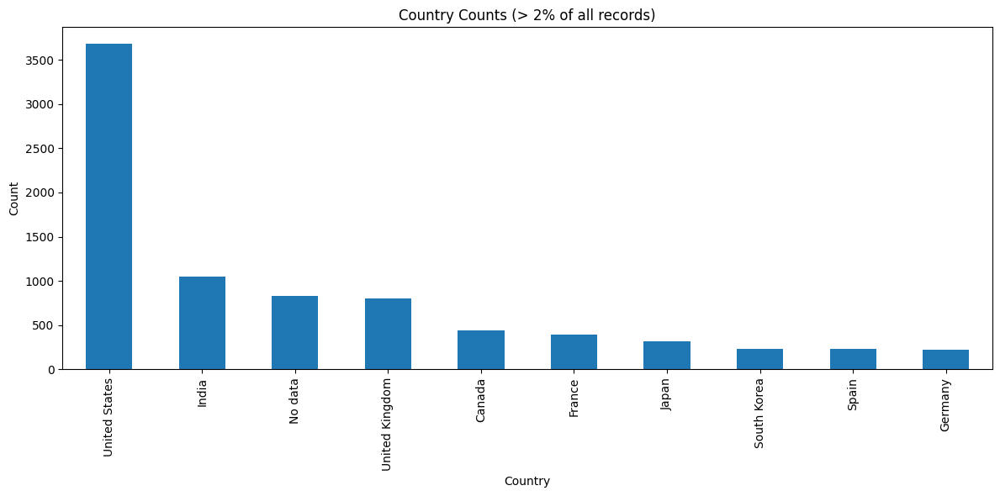
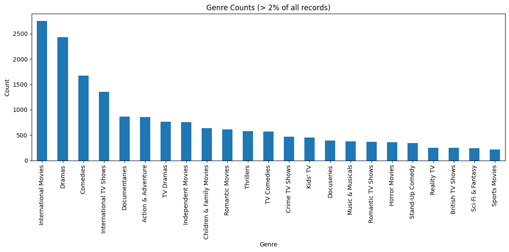
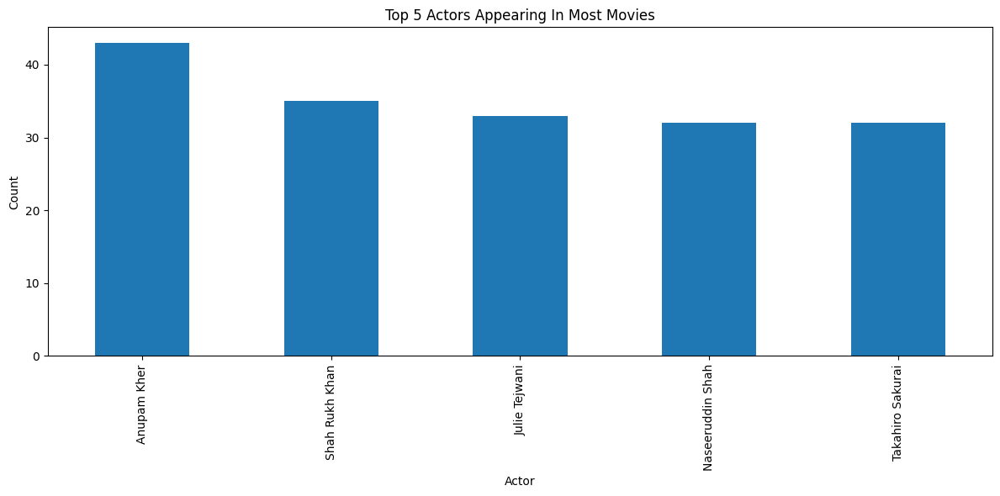
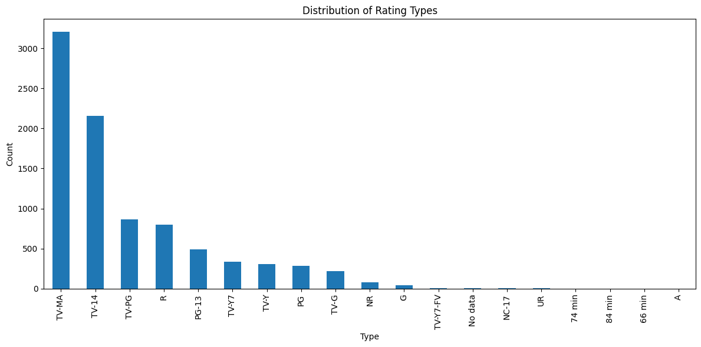

# Netflix Movies analysis project

## Target of project
- Practice using libraries like pandas, matplotlib
- Practice explaining targeted problems
- Practice visualization

## Data
Data I used comes from a website called "Kaggle" which is a data science community with resources
The file i used can be found at link: https://www.kaggle.com/datasets/rahulvyasm/netflix-movies-and-tv-shows

## Data description:
- show_id: A unique identifier for each title.
- type: The category of the title, which is either 'Movie' or 'TV Show'.
- title: The name of the movie or TV show.
- director: The director(s) of the movie or TV show. (Contains null values for some entries, especially TV shows where this information might not be applicable.)
cast: The list of main actors/actresses in the title. (Some entries might not have this information.)
- country: The country or countries where the movie or TV show was produced.
- date_added: The date the title was added to Netflix.
- release_year: The year the movie or TV show was originally released.
- rating: The age rating of the title.
- duration: The duration of the title, in minutes for movies and seasons for TV shows.
- listed_in: The genres the title falls under.
- description: A brief summary of the title.


### Importing libraries


```python
import pandas as pd
import matplotlib.pyplot as plt
import seaborn as sns
from ydata_profiling import ProfileReport
```

### Loading data


```python
netflix_movies = pd.read_csv('data/netflix_titles.csv', delimiter=',', decimal='.', index_col=0, encoding='latin1',  dtype={'listed_in': 'object', 'country': 'object'})
```

### Data exploration


```python
netflix_movies.info()
```

    <class 'pandas.core.frame.DataFrame'>
    Index: 8809 entries, s1 to s8809
    Data columns (total 25 columns):
     #   Column        Non-Null Count  Dtype  
    ---  ------        --------------  -----  
     0   type          8809 non-null   object 
     1   title         8809 non-null   object 
     2   director      6175 non-null   object 
     3   cast          7984 non-null   object 
     4   country       7978 non-null   object 
     5   date_added    8799 non-null   object 
     6   release_year  8809 non-null   int64  
     7   rating        8805 non-null   object 
     8   duration      8806 non-null   object 
     9   listed_in     8809 non-null   object 
     10  description   8809 non-null   object 
     11  Unnamed: 12   0 non-null      float64
     12  Unnamed: 13   0 non-null      float64
     13  Unnamed: 14   0 non-null      float64
     14  Unnamed: 15   0 non-null      float64
     15  Unnamed: 16   0 non-null      float64
     16  Unnamed: 17   0 non-null      float64
     17  Unnamed: 18   0 non-null      float64
     18  Unnamed: 19   0 non-null      float64
     19  Unnamed: 20   0 non-null      float64
     20  Unnamed: 21   0 non-null      float64
     21  Unnamed: 22   0 non-null      float64
     22  Unnamed: 23   0 non-null      float64
     23  Unnamed: 24   0 non-null      float64
     24  Unnamed: 25   0 non-null      float64
    dtypes: float64(14), int64(1), object(10)
    memory usage: 2.0+ MB
    


```python
netflix_movies.describe()
```


<div>
<style scoped>
    .dataframe tbody tr th:only-of-type {
        vertical-align: middle;
    }

    .dataframe tbody tr th {
        vertical-align: top;
    }

    .dataframe thead th {
        text-align: right;
    }
</style>
<table border="1" class="dataframe">
  <thead>
    <tr style="text-align: right;">
      <th></th>
      <th>release_year</th>
      <th>Unnamed: 12</th>
      <th>Unnamed: 13</th>
      <th>Unnamed: 14</th>
      <th>Unnamed: 15</th>
      <th>Unnamed: 16</th>
      <th>Unnamed: 17</th>
      <th>Unnamed: 18</th>
      <th>Unnamed: 19</th>
      <th>Unnamed: 20</th>
      <th>Unnamed: 21</th>
      <th>Unnamed: 22</th>
      <th>Unnamed: 23</th>
      <th>Unnamed: 24</th>
      <th>Unnamed: 25</th>
    </tr>
  </thead>
  <tbody>
    <tr>
      <th>count</th>
      <td>8809.000000</td>
      <td>0.0</td>
      <td>0.0</td>
      <td>0.0</td>
      <td>0.0</td>
      <td>0.0</td>
      <td>0.0</td>
      <td>0.0</td>
      <td>0.0</td>
      <td>0.0</td>
      <td>0.0</td>
      <td>0.0</td>
      <td>0.0</td>
      <td>0.0</td>
      <td>0.0</td>
    </tr>
    <tr>
      <th>mean</th>
      <td>2014.181292</td>
      <td>NaN</td>
      <td>NaN</td>
      <td>NaN</td>
      <td>NaN</td>
      <td>NaN</td>
      <td>NaN</td>
      <td>NaN</td>
      <td>NaN</td>
      <td>NaN</td>
      <td>NaN</td>
      <td>NaN</td>
      <td>NaN</td>
      <td>NaN</td>
      <td>NaN</td>
    </tr>
    <tr>
      <th>std</th>
      <td>8.818932</td>
      <td>NaN</td>
      <td>NaN</td>
      <td>NaN</td>
      <td>NaN</td>
      <td>NaN</td>
      <td>NaN</td>
      <td>NaN</td>
      <td>NaN</td>
      <td>NaN</td>
      <td>NaN</td>
      <td>NaN</td>
      <td>NaN</td>
      <td>NaN</td>
      <td>NaN</td>
    </tr>
    <tr>
      <th>min</th>
      <td>1925.000000</td>
      <td>NaN</td>
      <td>NaN</td>
      <td>NaN</td>
      <td>NaN</td>
      <td>NaN</td>
      <td>NaN</td>
      <td>NaN</td>
      <td>NaN</td>
      <td>NaN</td>
      <td>NaN</td>
      <td>NaN</td>
      <td>NaN</td>
      <td>NaN</td>
      <td>NaN</td>
    </tr>
    <tr>
      <th>25%</th>
      <td>2013.000000</td>
      <td>NaN</td>
      <td>NaN</td>
      <td>NaN</td>
      <td>NaN</td>
      <td>NaN</td>
      <td>NaN</td>
      <td>NaN</td>
      <td>NaN</td>
      <td>NaN</td>
      <td>NaN</td>
      <td>NaN</td>
      <td>NaN</td>
      <td>NaN</td>
      <td>NaN</td>
    </tr>
    <tr>
      <th>50%</th>
      <td>2017.000000</td>
      <td>NaN</td>
      <td>NaN</td>
      <td>NaN</td>
      <td>NaN</td>
      <td>NaN</td>
      <td>NaN</td>
      <td>NaN</td>
      <td>NaN</td>
      <td>NaN</td>
      <td>NaN</td>
      <td>NaN</td>
      <td>NaN</td>
      <td>NaN</td>
      <td>NaN</td>
    </tr>
    <tr>
      <th>75%</th>
      <td>2019.000000</td>
      <td>NaN</td>
      <td>NaN</td>
      <td>NaN</td>
      <td>NaN</td>
      <td>NaN</td>
      <td>NaN</td>
      <td>NaN</td>
      <td>NaN</td>
      <td>NaN</td>
      <td>NaN</td>
      <td>NaN</td>
      <td>NaN</td>
      <td>NaN</td>
      <td>NaN</td>
    </tr>
    <tr>
      <th>max</th>
      <td>2024.000000</td>
      <td>NaN</td>
      <td>NaN</td>
      <td>NaN</td>
      <td>NaN</td>
      <td>NaN</td>
      <td>NaN</td>
      <td>NaN</td>
      <td>NaN</td>
      <td>NaN</td>
      <td>NaN</td>
      <td>NaN</td>
      <td>NaN</td>
      <td>NaN</td>
      <td>NaN</td>
    </tr>
  </tbody>
</table>
</div>


```python
null_counts = netflix_movies.isnull().sum()
print("Number of null values in each column:\n{}".format(null_counts))
```

    Number of null values in each column:
    type               0
    title              0
    director        2634
    cast             825
    country          831
    date_added        10
    release_year       0
    rating             4
    duration           3
    listed_in          0
    description        0
    Unnamed: 12     8809
    Unnamed: 13     8809
    Unnamed: 14     8809
    Unnamed: 15     8809
    Unnamed: 16     8809
    Unnamed: 17     8809
    Unnamed: 18     8809
    Unnamed: 19     8809
    Unnamed: 20     8809
    Unnamed: 21     8809
    Unnamed: 22     8809
    Unnamed: 23     8809
    Unnamed: 24     8809
    Unnamed: 25     8809
    dtype: int64
    


```python
num_rows = len(netflix_movies)
num_rows
```


    8809


### Data cleaning

#### Deleting unnamed columns


```python
# drop unnamed columns
netflix_movies.drop(netflix_movies.columns[netflix_movies.columns.str.contains('unnamed', case=False)], axis=1, inplace=True)
```


```python
# null counts
null_counts = netflix_movies.isnull().sum()
print("Number of null values in each column:\n{}".format(null_counts))
```

    Number of null values in each column:
    type               0
    title              0
    director        2634
    cast             825
    country          831
    date_added        10
    release_year       0
    rating             4
    duration           3
    listed_in          0
    description        0
    dtype: int64
    

#### Converting data types for easier access


```python
text_columns = netflix_movies.select_dtypes(include=['object']).columns
```


```python
text_columns
```


    Index(['type', 'title', 'director', 'cast', 'country', 'date_added', 'rating',
           'duration', 'listed_in', 'description'],
          dtype='object')


```python
# Director null values handling
# Replace null values with 'No data' for easier readability
netflix_movies["director"] = netflix_movies["director"].fillna('No data')
netflix_movies["director"] = netflix_movies["director"].str.split(",")
netflix_movies["director"] = netflix_movies["director"].apply(lambda x: [item.strip() for item in x if item.strip() != ''])

print(netflix_movies['director'])
```

    show_id
    s1       [Kirsten Johnson]
    s2               [No data]
    s3       [Julien Leclercq]
    s4               [No data]
    s5               [No data]
                   ...        
    s8805    [Ruben Fleischer]
    s8806       [Peter Hewitt]
    s8807        [Mozez Singh]
    s8808       [Yeon Sang-ho]
    s8809       [Susanne Bier]
    Name: director, Length: 8809, dtype: object
    


```python
# Cast null values handling
# Replace null values with 'No data' for easier readability
netflix_movies["cast"] = netflix_movies["cast"].fillna('No data')
netflix_movies["cast"] = netflix_movies["cast"].str.split(",")
netflix_movies["cast"] = netflix_movies["cast"].apply(lambda x: [item.strip() for item in x if item.strip() != ''])

print(netflix_movies['cast'])
```

    show_id
    s1                                               [No data]
    s2       [Ama Qamata, Khosi Ngema, Gail Mabalane, Thaba...
    s3       [Sami Bouajila, Tracy Gotoas, Samuel Jouy, Nab...
    s4                                               [No data]
    s5       [Mayur More, Jitendra Kumar, Ranjan Raj, Alam ...
                                   ...                        
    s8805    [Jesse Eisenberg, Woody Harrelson, Emma Stone,...
    s8806    [Tim Allen, Courteney Cox, Chevy Chase, Kate M...
    s8807    [Vicky Kaushal, Sarah-Jane Dias, Raaghav Chana...
    s8808         [Shin Hyun-been, Jeon Yeo-bin, Goo Kyo-hwan]
    s8809    [Bradley Cooper, Jennifer Lawrence, Toby Jones...
    Name: cast, Length: 8809, dtype: object
    


```python
# Replace null values with 'No data' for easier readability
netflix_movies["country"] = netflix_movies["country"].fillna('No data')
netflix_movies["country"] = netflix_movies["country"].str.split(",")
netflix_movies["country"] = netflix_movies["country"].apply(lambda x: [item.strip() for item in x if item.strip() != ''])

print(netflix_movies['country'])
```

    show_id
    s1       [United States]
    s2        [South Africa]
    s3             [No data]
    s4             [No data]
    s5               [India]
                  ...       
    s8805    [United States]
    s8806    [United States]
    s8807            [India]
    s8808      [South Korea]
    s8809    [United States]
    Name: country, Length: 8809, dtype: object
    


```python
no_data_count = netflix_movies["country"].explode().str.contains('No data').sum()
print(f"The number of 'No data' values in the 'country' column is: {no_data_count}")
```

    The number of 'No data' values in the 'country' column is: 831
    


```python
# Convert dates to datetime type
netflix_movies['date_added'] = netflix_movies['date_added'].str.strip()
netflix_movies['date_added'] = pd.to_datetime(netflix_movies['date_added'], errors='coerce')
print(netflix_movies['date_added'])
```

    show_id
    s1      2021-09-25
    s2      2021-09-24
    s3      2021-09-24
    s4      2021-09-24
    s5      2021-09-24
               ...    
    s8805   2019-11-01
    s8806   2020-01-11
    s8807   2019-03-02
    s8808   2024-04-05
    s8809   2024-04-05
    Name: date_added, Length: 8809, dtype: datetime64[ns]
    


```python
# remove rows where date_added is null
netflix_movies = netflix_movies[~netflix_movies['date_added'].isna()]
```


```python
print(f"The number of null values in the 'date_added' column is: {netflix_movies['date_added'].isnull().sum()}")
```

    The number of null values in the 'date_added' column is: 0
    


```python
# Splitting column 'listed_in' as there can be multiple values in column
netflix_movies["listed_in"] = netflix_movies["listed_in"].str.split(",")
netflix_movies["listed_in"] = netflix_movies["listed_in"].apply(lambda x: [item.strip() for item in x])

print(netflix_movies['listed_in'])
```

    show_id
    s1                                         [Documentaries]
    s2       [International TV Shows, TV Dramas, TV Mysteries]
    s3       [Crime TV Shows, International TV Shows, TV Ac...
    s4                                [Docuseries, Reality TV]
    s5       [International TV Shows, Romantic TV Shows, TV...
                                   ...                        
    s8805                            [Comedies, Horror Movies]
    s8806                 [Children & Family Movies, Comedies]
    s8807     [Dramas, International Movies, Music & Musicals]
    s8808                             [Sci-fi, Horror, Action]
    s8809                           [Drama, Romance, Thriller]
    Name: listed_in, Length: 8799, dtype: object
    


```python
# Handling rating null values
netflix_movies['rating'] = netflix_movies['rating'].fillna('No data')
print(netflix_movies['rating'])
```

    show_id
    s1       PG-13
    s2       TV-MA
    s3       TV-MA
    s4       TV-MA
    s5       TV-MA
             ...  
    s8805        R
    s8806       PG
    s8807    TV-14
    s8808    TV-MA
    s8809        A
    Name: rating, Length: 8799, dtype: object
    


```python
# Handling duration null values
netflix_movies['duration'] = netflix_movies['duration'].fillna('No data')
print(netflix_movies['duration'])
```

    show_id
    s1          90 min
    s2       2 Seasons
    s3        1 Season
    s4        1 Season
    s5       2 Seasons
               ...    
    s8805       88 min
    s8806       88 min
    s8807      111 min
    s8808     1 Season
    s8809      110 min
    Name: duration, Length: 8799, dtype: object
    

### Dataset after cleaning


```python
netflix_movies.head()
```


<div>
<style scoped>
    .dataframe tbody tr th:only-of-type {
        vertical-align: middle;
    }

    .dataframe tbody tr th {
        vertical-align: top;
    }

    .dataframe thead th {
        text-align: right;
    }
</style>
<table border="1" class="dataframe">
  <thead>
    <tr style="text-align: right;">
      <th></th>
      <th>type</th>
      <th>title</th>
      <th>director</th>
      <th>cast</th>
      <th>country</th>
      <th>date_added</th>
      <th>release_year</th>
      <th>rating</th>
      <th>duration</th>
      <th>listed_in</th>
      <th>description</th>
    </tr>
    <tr>
      <th>show_id</th>
      <th></th>
      <th></th>
      <th></th>
      <th></th>
      <th></th>
      <th></th>
      <th></th>
      <th></th>
      <th></th>
      <th></th>
      <th></th>
    </tr>
  </thead>
  <tbody>
    <tr>
      <th>s1</th>
      <td>Movie</td>
      <td>Dick Johnson Is Dead</td>
      <td>[Kirsten Johnson]</td>
      <td>[No data]</td>
      <td>[United States]</td>
      <td>2021-09-25</td>
      <td>2020</td>
      <td>PG-13</td>
      <td>90 min</td>
      <td>[Documentaries]</td>
      <td>As her father nears the end of his life, filmm...</td>
    </tr>
    <tr>
      <th>s2</th>
      <td>TV Show</td>
      <td>Blood &amp; Water</td>
      <td>[No data]</td>
      <td>[Ama Qamata, Khosi Ngema, Gail Mabalane, Thaba...</td>
      <td>[South Africa]</td>
      <td>2021-09-24</td>
      <td>2021</td>
      <td>TV-MA</td>
      <td>2 Seasons</td>
      <td>[International TV Shows, TV Dramas, TV Mysteries]</td>
      <td>After crossing paths at a party, a Cape Town t...</td>
    </tr>
    <tr>
      <th>s3</th>
      <td>TV Show</td>
      <td>Ganglands</td>
      <td>[Julien Leclercq]</td>
      <td>[Sami Bouajila, Tracy Gotoas, Samuel Jouy, Nab...</td>
      <td>[No data]</td>
      <td>2021-09-24</td>
      <td>2021</td>
      <td>TV-MA</td>
      <td>1 Season</td>
      <td>[Crime TV Shows, International TV Shows, TV Ac...</td>
      <td>To protect his family from a powerful drug lor...</td>
    </tr>
    <tr>
      <th>s4</th>
      <td>TV Show</td>
      <td>Jailbirds New Orleans</td>
      <td>[No data]</td>
      <td>[No data]</td>
      <td>[No data]</td>
      <td>2021-09-24</td>
      <td>2021</td>
      <td>TV-MA</td>
      <td>1 Season</td>
      <td>[Docuseries, Reality TV]</td>
      <td>Feuds, flirtations and toilet talk go down amo...</td>
    </tr>
    <tr>
      <th>s5</th>
      <td>TV Show</td>
      <td>Kota Factory</td>
      <td>[No data]</td>
      <td>[Mayur More, Jitendra Kumar, Ranjan Raj, Alam ...</td>
      <td>[India]</td>
      <td>2021-09-24</td>
      <td>2021</td>
      <td>TV-MA</td>
      <td>2 Seasons</td>
      <td>[International TV Shows, Romantic TV Shows, TV...</td>
      <td>In a city of coaching centers known to train I...</td>
    </tr>
  </tbody>
</table>
</div>


```python
netflix_movies.info()
```

    <class 'pandas.core.frame.DataFrame'>
    Index: 8799 entries, s1 to s8809
    Data columns (total 11 columns):
     #   Column        Non-Null Count  Dtype         
    ---  ------        --------------  -----         
     0   type          8799 non-null   object        
     1   title         8799 non-null   object        
     2   director      8799 non-null   object        
     3   cast          8799 non-null   object        
     4   country       8799 non-null   object        
     5   date_added    8799 non-null   datetime64[ns]
     6   release_year  8799 non-null   int64         
     7   rating        8799 non-null   object        
     8   duration      8799 non-null   object        
     9   listed_in     8799 non-null   object        
     10  description   8799 non-null   object        
    dtypes: datetime64[ns](1), int64(1), object(9)
    memory usage: 824.9+ KB
    


```python
null_counts = netflix_movies.isnull().sum()
print("Number of null values in each column:\n{}".format(null_counts))
```

    Number of null values in each column:
    type            0
    title           0
    director        0
    cast            0
    country         0
    date_added      0
    release_year    0
    rating          0
    duration        0
    listed_in       0
    description     0
    dtype: int64
    

## Analysis


```python
# Count the number of occurrences for each country
country_counts = netflix_movies['country'].explode().value_counts()

# Calculate the total number of records
total_records = netflix_movies.shape[0]

# Filter the countries with more than 2% of all records
top_countries = country_counts[country_counts / total_records > 0.02].index

# Create a bar chart for the top countries
plt.figure(figsize=(12, 6))
country_counts[top_countries].plot(kind='bar')
plt.title('Country Counts (> 2% of all records)')
plt.xlabel('Country')
plt.ylabel('Count')
plt.xticks(rotation=90)
plt.tight_layout()
plt.show()
```


    

    


```python
# Count the number of occurrences for each genre
genre_counts = netflix_movies['listed_in'].explode().value_counts()

# Calculate the total number of records
total_records = netflix_movies.shape[0]

# Filter the genres with more than 2% of all records
top_genres = genre_counts[genre_counts / total_records > 0.02].index

# Create a bar chart for the top genres
plt.figure(figsize=(12, 6))
genre_counts[top_genres].plot(kind='bar')
plt.title('Genre Counts (> 2% of all records)')
plt.xlabel('Genre')
plt.ylabel('Count')
plt.xticks(rotation=90)
plt.tight_layout()
plt.show()
```


    

    


```python
# Count the number of occurrences for each genre
actor_counts = netflix_movies['cast'].explode().value_counts()
actor_counts = actor_counts[actor_counts.index != 'No data']

top_actors = actor_counts.head(5)

# Create a bar plot for the top 5 actors
top_actors.plot(kind='bar', figsize=(12, 6))
plt.title('Top 5 Actors Appearing In Most Movies')
plt.xlabel('Actor')
plt.ylabel('Count')
plt.xticks(rotation=90)
plt.tight_layout()
plt.show()
```


    

    


```python
# Count the occurrences of each 'type' value
type_counts = netflix_movies['type'].value_counts()

# Create a bar chart
plt.figure(figsize=(12, 6))
type_counts.plot(kind='bar')
plt.title('Distribution of Movie/TV Show Types')
plt.xlabel('Type')
plt.ylabel('Count')
plt.xticks(rotation=90)
plt.tight_layout()
plt.show()
```


    

    


```python
# Count the occurrences of each 'type' value
rating_counts = netflix_movies['rating'].value_counts()

# Create a bar chart
plt.figure(figsize=(12, 6))
rating_counts.plot(kind='bar')
plt.title('Distribution of Rating Types')
plt.xlabel('Type')
plt.ylabel('Count')
plt.xticks(rotation=90)
plt.tight_layout()
plt.show()
```


    

    

